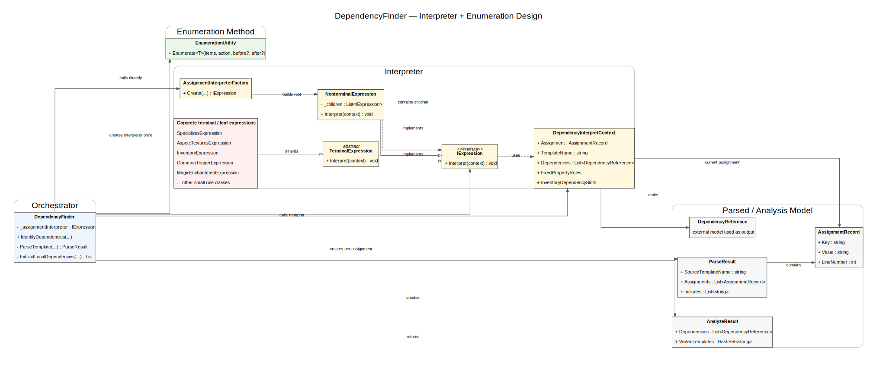

# DependencyFinder Patterns Guide

This guide explains only two patterns in the current codebase:

1. Interpreter pattern
2. Enumeration Method pattern

## Where These Patterns Live

- Core orchestrator: src/Services/DependencyFinder.cs
- Interpreter support types:
  - src/Services/DependencyFinder/Interpreter/DependencyFinder.DependencyInterpretContext.cs
  - src/Services/DependencyFinder/Interpreter/DependencyFinder.IAssignmentExpression.cs
  - src/Services/DependencyFinder/Interpreter/DependencyFinder.TerminalAssignmentExpression.cs
  - src/Services/DependencyFinder/Interpreter/DependencyFinder.NonterminalAssignmentExpression.cs
- Parsed language model types:
  - src/Services/DependencyFinder/Interpreter/DependencyFinder.AssignmentRecord.cs
  - src/Services/DependencyFinder/Interpreter/DependencyFinder.ParseResult.cs
  - src/Services/DependencyFinder/Interpreter/DependencyFinder.AnalyzeResult.cs

## What The Interpreter Is Interpreting

The input language is the template source text (GAS-like content) from BitsTemplate.SourceCode.

The interpreter focuses on assignment lines such as key = value and decides whether each assignment implies one or more dependencies.

Examples of dependency meanings:

- template dependency
- texture dependency
- sound dependency
- script dependency

## Interpreter Pattern In This Code

The pattern is implemented in assignment-level rule evaluation.

### Roles

1. Context
   - DependencyInterpretContext
   - Contains everything needed for evaluation of one assignment:
     - current assignment
     - template name
     - output dependency list
     - DependencyFinder helper access

2. Abstract expression
   - IAssignmentExpression
   - Method: Interpret(context)

3. Terminal expression
   - TerminalAssignmentExpression
   - Wraps one concrete rule (for example, a condition for specializes or aspect:textures)

4. Nonterminal expression
   - NonterminalAssignmentExpression
   - Holds child expressions and executes them in sequence
   - This acts as the composed grammar runner for all assignment rules

### Execution Pipeline

1. ParseTemplate creates ParseResult with AssignmentRecord entries.
2. ExtractLocalDependencies loops assignments.
3. For each assignment, DependencyFinder creates DependencyInterpretContext.
4. _assignmentInterpreter.Interpret(context) is called.
5. The nonterminal expression runs all terminal rules.
6. Each matching terminal emits DependencyReference entries.

## Enumeration Method Pattern In This Code

Enumeration Method means: the aggregate owns traversal, and client logic is provided as an action.

This is implemented by:

- EnumerateAssignments(ParseResult parsed, Action<AssignmentRecord> action, ...)
- EnumerateDependencies(IEnumerable<DependencyReference> dependencies, Action<DependencyReference> action, ...)

### Why This Matches The Pattern

1. Traversal is hidden inside these methods.
2. Caller passes the task to run on each element.
3. Optional before and after hooks allow pre/post iteration behavior.

## How Both Patterns Work Together

1. Enumeration Method handles iteration over assignments.
2. Interpreter handles meaning of each assignment.
3. Combined effect:
   - iteration logic stays centralized
   - rule logic stays modular and composable

## Class Diagram

## Mental Model

Think of the system as two layers:

1. Enumerator layer:
   - walks items
2. Interpreter layer:
   - explains what each walked item means

That separation is the main design value of the current implementation.
